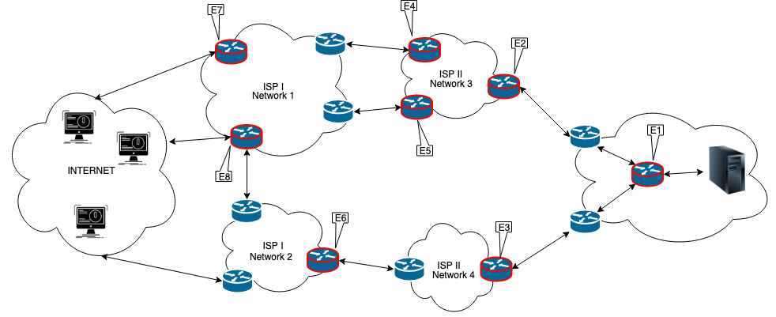

# Implementing DDoS Attacks Collaborative Mitigation Mechanism

This project is based on "[Offloading Real-time DDoS Attack Detection to Programmable Data Planes](https://ieeexplore.ieee.org/document/8717869)" (IM 2019) Project from [Ângelo Lapolli](https://github.com/aclapolli) and [Jonatas Marques](https://github.com/jonadmark/)

### Prerequisites
We have extended both the behavioral model and the P4 reference compiler (p4c) to support hashing as required by our count sketch (For Attack Detection), in our Heavy Hitters Detection and our Bloom Filter implementation.
First, clone our forked repositories and follow the installation guidelines within:

- [Behavioral Model](https://github.com/andreyqg/behavioral-model)
- [P4_16 compiler](https://github.com/andreyqg/p4c)

You can use our [install.sh](https://github.com/andreyqg/ddosmitigation/blob/master/install.sh) to install all you need to run our project.

#### Quick Start
Feel free to do MAKE. This compiles our P4 code, create the network devices in Mininet and load the necessary rules on each switch (via CLI and Runtime).

This is the proposed topology.



The Detection  Mechanism is configured with '8192' (2<sup>14</sup>) packet for each observation window

In case of Attack Detection, the last package of every observation window will be forwarded to the appropiates switches containing the following custom header:
```
// EtherType 0xFD /* 253 - Used for experimentation and testing (RFC 3692 - Chap. 2.1) */
header DDOSD {
    bit<32> packet_num;    // The packet number within the observation window (always equal to m)
    bit<32> src_entropy;   // The last observation window entropy of source IP addresses (scaled by 2^4)
    bit<32> src_ewma;      // The current EWMA for the entropy of source IP address (scaled by 2^18)
    bit<32> src_ewmmd;     // The current EWMMD for the entropy of source IP address (scaled by 2^18)
    bit<32> dst_entropy;   // The last observation window entropy of destination IP addresses (scaled by 2^4)
    bit<32> dst_ewma;      // The current EWMA for the entropy of destination IP address (scaled by 2^18)
    bit<32> dst_ewmmd;     // The current EWMMD for the entropy of destination IP address (scaled by 2^18)
    bit<8> alarm;          // It is set to 0x01 to indicate the detection of a DDoS attack
    bit<8> protocol;       // Indicates the following header TCP
    bit<8> count_ip;       // Number of IP Address in alarm packet
    
header ALARM {
    bit<32> ip_alarm;      // IP Address suspects pool for checking
}
```
